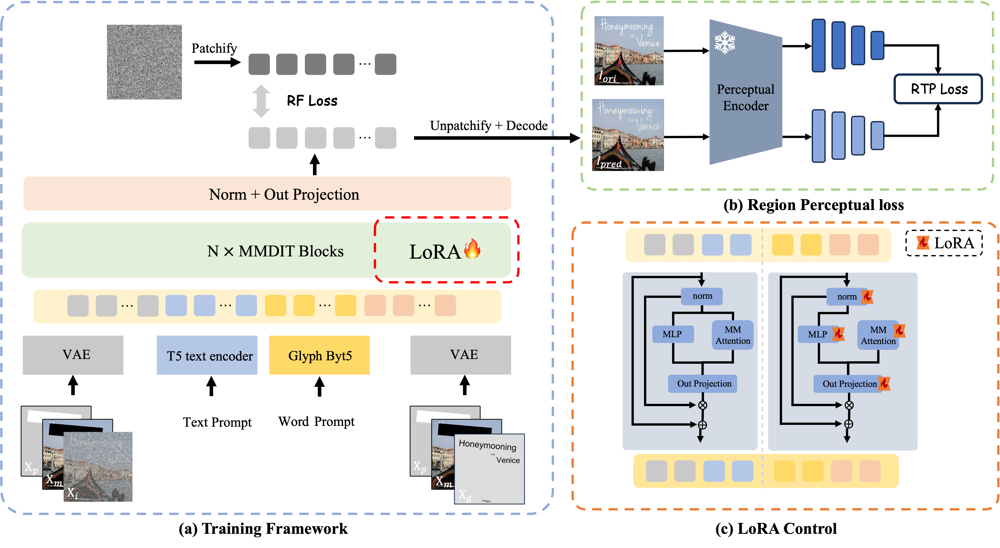
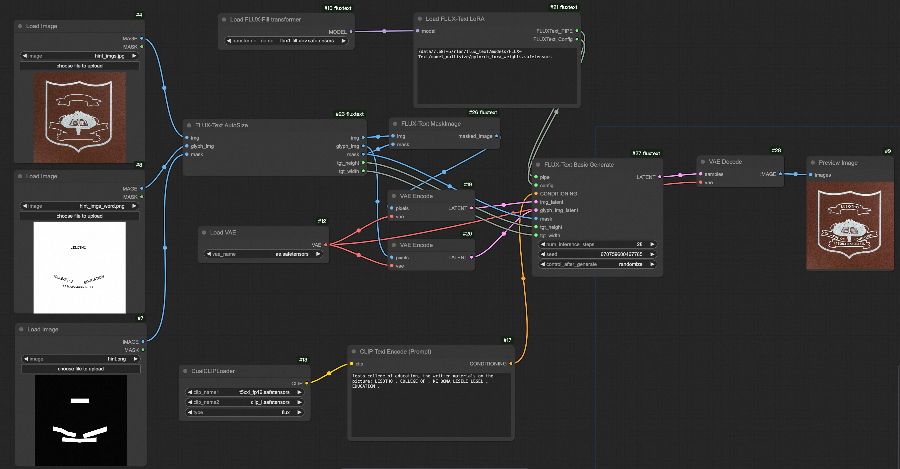
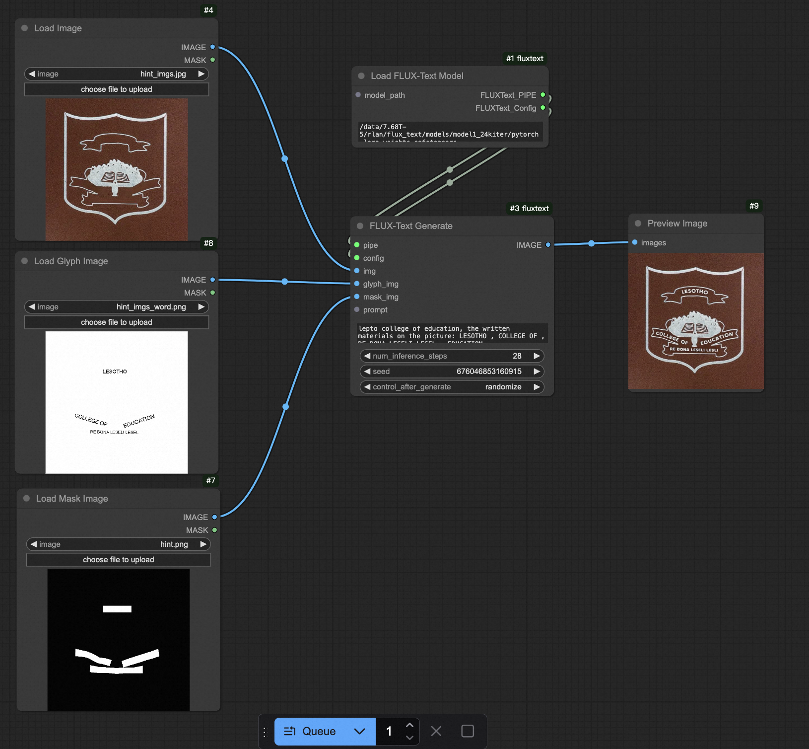
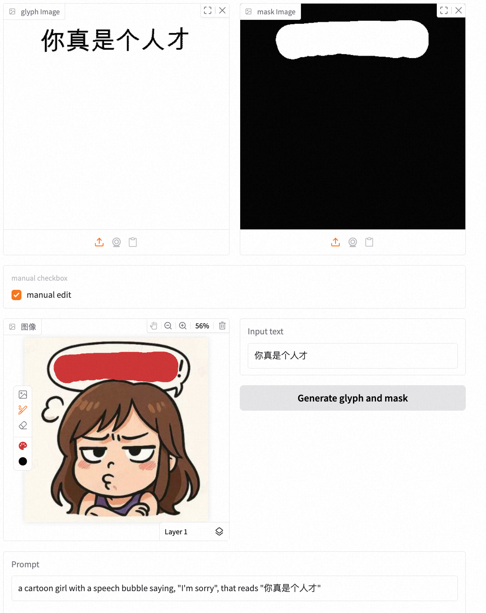

# Implementation of FLUX-Text

FLUX-Text: A Simple and Advanced Diffusion Transformer Baseline for Scene Text Editing

<a href='https://amap-ml.github.io/FLUX-text/'></a>
<a href='https://arxiv.org/abs/2505.03329'></a> 
<a href="https://huggingface.co/GD-ML/FLUX-Text/"></a>
<!-- <a ></a> -->

> *[Rui Lan](https://scholar.google.com/citations?user=zwVlWXwAAAAJ&hl=zh-CN), [Yancheng Bai](https://scholar.google.com/citations?hl=zh-CN&user=Ilx8WNkAAAAJ&view_op=list_works&sortby=pubdate), [Xu Duan](https://scholar.google.com/citations?hl=zh-CN&user=EEUiFbwAAAAJ), [Mingxing Li](https://scholar.google.com/citations?hl=zh-CN&user=-pfkprkAAAAJ), [Lei Sun](https://allylei.github.io), [Xiangxiang Chu](https://scholar.google.com/citations?hl=zh-CN&user=jn21pUsAAAAJ&view_op=list_works&sortby=pubdate)*
> <br>
> ALibaba Group


## 📖 Overview
* **Motivation:** Scene text editing is a challenging task that aims to modify or add text in images while maintaining the fidelity of newly generated text and visual coherence with the background. The main challenge of this task is that we need to edit multiple line texts with diverse language attributes (e.g., fonts, sizes, and styles), language types (e.g., English, Chinese), and visual scenarios (e.g., poster, advertising, gaming).
* **Contribution:** We propose FLUX-Text, a novel text editing framework for editing multi-line texts in complex visual scenes. By incorporating a lightweight Condition Injection LoRA module, Regional text perceptual loss, and two-stage training strategy, we significantly significant improvements on both Chinese and English benchmarks.


## News

- **2025-07-16**: 🔥 Update comfyui node. We have decoupled the FLUX-Text node to support the use of more basic nodes. Due to differences in node computation in ComfyUI, if you need more consistent results, you should set min_length to 512 in the [code](https://github.com/comfyanonymous/ComfyUI/blob/master/comfy/text_encoders/flux.py#L12).

<div align="center">
<table>
<tr>
    <td></td>
</tr>
<tr>
    <td align="center">workflow/FLUX-Text-Basic-Workflow.json</td>
</tr>
</table>
</div>

- **2025-07-13**: 🔥 The training code has been updated. The code now supports multi-scale training.

- **2025-07-13**: 🔥 Update the low-VRAM version of the Gradio demo, which It currently requires 25GB of VRAM to run. Looking forward to more efficient, lower-memory solutions from the community.

- **2025-07-08**: 🔥 ComfyUI Node is supported! You can now build an workflow based on FLUX-Text for editing posters. It is definitely worth trying to set up a workflow to automatically enhance product image service information and service scope. Meanwhile, utilizing the first and last frames enables the creation of video data with text effects. Thanks to the [community work](https://github.com/AMAP-ML/FluxText/issues/4), FLUX-Text was run on 8GB VRAM. 

<div align="center">
<table>
<tr>
    <td></td>
</tr>
<tr>
    <td align="center">workflow/FLUX-Text-Workflow.json</td>
</tr>
</table>
</div>

<div align="center">
<table>
<tr>
    <td></td>
    <td></td>
    <td></td>
    <td></td>
</tr>
<tr>
    <td align="center">original image</td>
    <td align="center">edited image</td>
    <td align="center">original image</td>
    <td align="center">edited image</td>
</tr>
</table>
</div>

<div align="center">
<table>
<tr>
    <td></td>
    <td></td>
</tr>
<tr>
    <td></td>
    <td></td>
</tr>
<tr>
    <td align="center">last frame</td>
    <td align="center">video</td>
</tr>
</table>
</div>

- **2025-07-04**: 🔥 We have released gradio demo! You can now try out FLUX-Text.

<div align="center">
<table>
<tr>
    <td></td>
    <td></td>
</tr>
<tr>
    <td align="center">Example 1</td>
    <td align="center">Example 2</td>
</tr>
</table>
</div>

- **2025-07-03**: 🔥 We have released our [pre-trained checkpoints](https://huggingface.co/GD-ML/FLUX-Text/) on Hugging Face! You can now try out FLUX-Text with the official weights.

- **2025-06-26**: ⭐️ Inference and evaluate code are released. Once we have ensured that everything is functioning correctly, the new model will be merged into this repository.

## Todo List
1. - [x] Inference code 
2. - [x] Pre-trained weights 
3. - [x] Gradio demo
4. - [x] ComfyUI
5. - [x] Training code

## 🛠️ Installation

We recommend using Python 3.10 and PyTorch with CUDA support. To set up the environment:

```bash
# Create a new conda environment
conda create -n flux_text python=3.10
conda activate flux_text

# Install other dependencies
pip install -r requirements.txt
pip install flash_attn --no-build-isolation
pip install Pillow==9.5.0
```

## 🤗 Model Introduction

FLUX-Text is an open-source version of the scene text editing model. FLUX-Text can be used for editing posters, emotions, and more. The table below displays the list of text editing models we currently offer, along with their foundational information.

<table style="border-collapse: collapse; width: 100%;">
  <tr>
    <th style="text-align: center;">Model Name</th>
    <th style="text-align: center;">Image Resolution</th>
    <th style="text-align: center;">Memory Usage</th>
    <th style="text-align: center;">English Sen.Acc</th>
    <th style="text-align: center;">Chinese Sen.Acc</th>
    <th style="text-align: center;">Download Link</th>
  </tr>
  <tr>
    <th style="text-align: center;">FLUX-Text-512</th>
    <th style="text-align: center;">512*512</th>
    <th style="text-align: center;">34G</th>
    <th style="text-align: center;">0.8419</th>
    <th style="text-align: center;">0.7132</th>
    <th style="text-align: center;"><a href="https://huggingface.co/GD-ML/FLUX-Text/tree/main/model_512">🤗 HuggingFace</a></th>
  </tr>
  <tr>
    <th style="text-align: center;">FLUX-Text</th>
    <th style="text-align: center;">Multi Resolution</th>
    <th style="text-align: center;">34G for (512*512)</th>
    <th style="text-align: center;">0.8228</th>
    <th style="text-align: center;">0.7161</th>
    <th style="text-align: center;"><a href="https://huggingface.co/GD-ML/FLUX-Text/tree/main/model_multisize">🤗 HuggingFace</a></th>
  </tr>
</table>

## 🔥 ComfyUI

<details close>
<summary> Installing via GitHub </summary>

First, install and set up [ComfyUI](https://github.com/comfyanonymous/ComfyUI), and then follow these steps:

1. **Clone FLUXText Repository**:
   ```shell
   git clone https://github.com/AMAP-ML/FluxText.git
   ```

2. **Install FluxText**:
   ```shell
   cd FluxText && pip install -r requirements.txt
   ```

3. **Integrate FluxText Comfy Nodes with ComfyUI**:
   - **Symbolic Link (Recommended)**:
     ```shell
     ln -s $(pwd)/ComfyUI-fluxtext path/to/ComfyUI/custom_nodes/
     ```
   - **Copy Directory**:
     ```shell
     cp -r ComfyUI-fluxtext path/to/ComfyUI/custom_nodes/
     ```

</details>

## 🔥 Quick Start

Here's a basic example of using FLUX-Text:

```python
import numpy as np
from PIL import Image
import torch
import yaml

from src.flux.condition import Condition
from src.flux.generate_fill import generate_fill
from src.train.model import OminiModelFIll
from safetensors.torch import load_file

config_path = ""
lora_path = ""
with open(config_path, "r") as f:
    config = yaml.safe_load(f)
model = OminiModelFIll(
        flux_pipe_id=config["flux_path"],
        lora_config=config["train"]["lora_config"],
        device=f"cuda",
        dtype=getattr(torch, config["dtype"]),
        optimizer_config=config["train"]["optimizer"],
        model_config=config.get("model", {}),
        gradient_checkpointing=True,
        byt5_encoder_config=None,
    )

state_dict = load_file(lora_path)
state_dict_new = {x.replace('lora_A', 'lora_A.default').replace('lora_B', 'lora_B.default').replace('transformer.', ''): v for x, v in state_dict.items()}
model.transformer.load_state_dict(state_dict_new, strict=False)
pipe = model.flux_pipe

prompt = "lepto college of education, the written materials on the picture: LESOTHO , COLLEGE OF , RE BONA LESELI LESEL , EDUCATION ."
hint = Image.open("assets/hint.png").resize((512, 512)).convert('RGB')
img = Image.open("assets/hint_imgs.jpg").resize((512, 512))
condition_img = Image.open("assets/hint_imgs_word.png").resize((512, 512)).convert('RGB')
hint = np.array(hint) / 255
condition_img = np.array(condition_img)
condition_img = (255 - condition_img) / 255
condition_img = [condition_img, hint, img]
position_delta = [0, 0]
condition = Condition(
                condition_type='word_fill',
                condition=condition_img,
                position_delta=position_delta,
            )
generator = torch.Generator(device="cuda")
res = generate_fill(
    pipe,
    prompt=prompt,
    conditions=[condition],
    height=512,
    width=512,
    generator=generator,
    model_config=config.get("model", {}),
    default_lora=True,
)
res.images[0].save('flux_fill.png')
```

## 🤗 gradio

You can upload the glyph image and mask image to edit text region. Or you can use `manual edit` to obtain glyph image and mask image.

first, download the model weight and config in [HuggingFace](https://huggingface.co/GD-ML/FLUX-Text)

```bash
python app.py --model_path xx.safetensors --config_path config.yaml
```

## 💪🏻  Training

1. Download training dataset [**AnyWord-3M**](https://modelscope.cn/datasets/iic/AnyWord-3M/summary) from ModelScope, unzip all \*.zip files in each subfolder, then open *\*.json* and modify the `data_root` with your own path of *imgs* folder for each sub dataset.

2. Download the ODM weights in [HuggingFace](https://huggingface.co/GD-ML/FLUX-Text/blob/main/epoch_100.pt).

3. (Optional) Download the pretrained weight in [HuggingFace](https://huggingface.co/GD-ML/FLUX-Text).

4. Run the training scripts. With 48GB of VRAM, you can train at 512×512 resolution with a batch size of 2.

```bash
bash train/script/train_word.sh
```


## 📊 Evaluation

For [Anytext-benchmark](https://modelscope.cn/datasets/iic/AnyText-benchmark/summary), please set the **config_path**, **model_path**, **json_path**, **output_dir** in the `eval/gen_imgs_anytext.sh` and generate the text editing results.

```bash
bash eval/gen_imgs_anytext.sh
```

For `Sen.ACC, NED, FID and LPIPS` evaluation, use the scripts in the `eval` folder.

```bash
bash eval/eval_ocr.sh
bash eval/eval_fid.sh
bash eval/eval_lpips.sh
```

## 📈 Results


## 🌹 Acknowledgement

Our work is primarily based on [OminiControl](https://github.com/Yuanshi9815/OminiControl), [AnyText](https://github.com/tyxsspa/AnyText), [Open-Sora](https://github.com/hpcaitech/Open-Sora), [Phantom](https://github.com/Phantom-video/Phantom). We are sincerely grateful for their excellent works.

## 📚 Citation

If you find our paper and code helpful for your research, please consider starring our repository ⭐ and citing our work ✏️.
```bibtex
@misc{lan2025fluxtext,
    title={FLUX-Text: A Simple and Advanced Diffusion Transformer Baseline for Scene Text Editing},
    author={Rui Lan and Yancheng Bai and Xu Duan and Mingxing Li and Lei Sun and Xiangxiang Chu},
    year={2025},
    eprint={2505.03329},
    archivePrefix={arXiv},
    primaryClass={cs.CV}
}
```